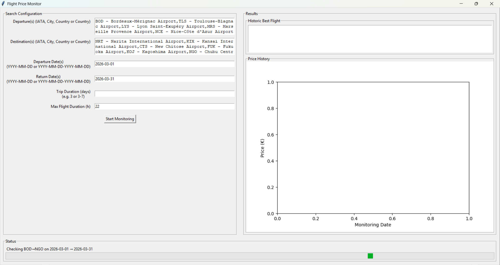

# FlightTracker (work in progress !)

A small tool to track flight prices over time. It automatically search for the best flight price and notify if this price is the lowest registered now. 

This application is still work in progress, but its main features should approximately works.



## Installation

```bash
pip install .
````

```bash
python -m flight_tracker
```

Or generate an executable with ``setup.py``.

